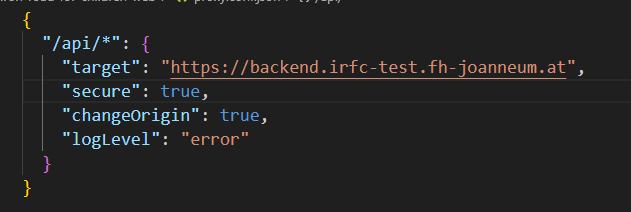

 
<h3 align="center">
  
</h3>
 

# Iron Road For Children Web (IRFC)

This project was generated with [Angular CLI](https://github.com/angular/angular-cli) version 15.2.4.

## Development server

Run `ng serve` for a dev server. Navigate to `http://localhost:4200/`. The application will automatically reload if you change any of the source files.

## Code scaffolding

Run `ng generate component component-name` to generate a new component. You can also use `ng generate directive|pipe|service|class|guard|interface|enum|module`.

## Build

Run `ng build` to build the project. The build artifacts will be stored in the `dist/` directory.

## Running unit tests

Run `ng test` to execute the unit tests via [Karma](https://karma-runner.github.io).

## Running end-to-end tests

Run `ng e2e` to execute the end-to-end tests via a platform of your choice. To use this command, you need to first add a package that implements end-to-end testing capabilities.

## Connecting to different backend environments

The backend environment used in the web project is set in the [proxy.conf.json](./proxy.conf.json). It by default uses https://backend.irfc-test.fh-joanneum.at, the testing environment. This can be changed to https://admin.irfc.fh-joanneum.at for the productive environment or to http://localhost:8080 for the local environment. If using the local environment the secure parameter needs to be set to false in the proxy.conf.json. To start the local backend see the [backend project ReadMe](../../Backend/iron-road-for-children-backend/README.md).

## Further help

To get more help on the Angular CLI use `ng help` or go check out the [Angular CLI Overview and Command Reference](https://angular.io/cli) page.
